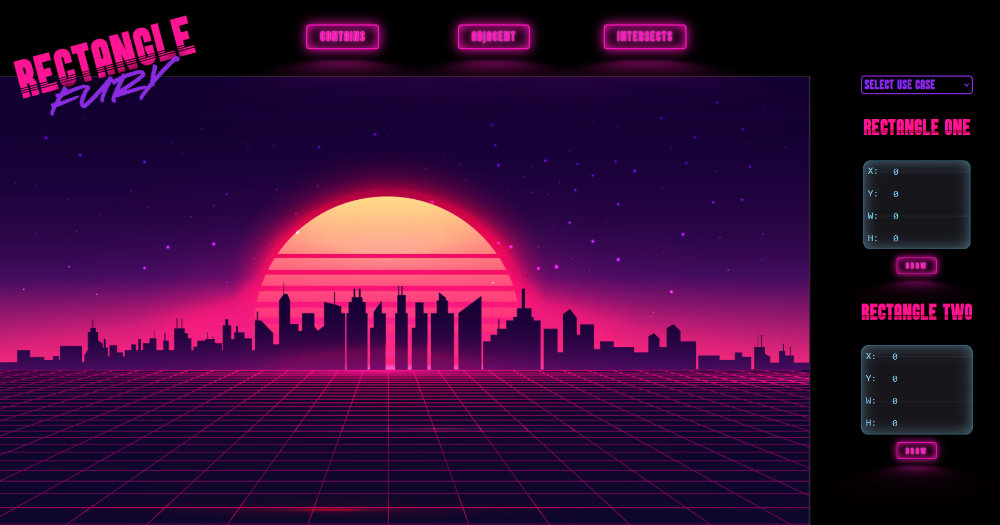

# Rectangle Assessment Project (Nuvalence) #
This project is my submission for the Nuvalence tech assessment. Written in Java and expanded to include an API that can
be called from a UI to test if two rectangles are intersecting, adjacent, or contained. The class contains a method for
each of the previously mentioned cases and will return a boolean value indicating its validity. The Dropwizard framework
was used to implement the API, and includes a simple health check to verify the app is up and running. CORS was also
configured to allow the accompanying UI to work for demoing the assignment's required class and application. The project
also contains tests that cover all required use cases provided in the assessment document.
---

## Running the Project ##
__This application runs with Java 17 and uses Maven as its package manager. It is recommended that you download and
install these dependencies to run.__

- [ ] Navigate to the project's root directory in a Command or Shell prompt
- [ ] Run `mvn package` to generate the required JAR and dependency-reduced-pom.xml files
- [ ] Run `java -jar ./target/Nuvalence-Rectangle-1.0-SNAPSHOT.jar server ./src/resources/local.yml` to start the application locally on port 8080

 

| Endpoints                   | Method | Body | Return  |
|-----------------------------| ------ |------|---------|
| `api/rectangles/intersect`  | POST | Rectangle[] | Boolean |
|  `api/rectangles/contained` | POST | Rectangle[] | Boolean |
 |  `api/rectangles/adjacent`  | POST | Rectangle[] | Boolean |
 |  `api/rectangles`           | GET | Null | String | 
 |  `api/status`               | GET | Null | Object | 

---
## The Rectangle Class ##
The Rectangle class utilizes 4 properties: X coordinate, Y coordinate, Width, and Height. The class utilizes these 
property values to verify intersections, containment, and adjacency with like named methods contained in the class.

#### Instantiate Class ####
`new Rectangle(float x, float y, float width, float height)`

#### Validate Intersection ####
`rectangleOne.intersects(rectangleTwo)`  
`rectangleOne.intersects(float x, float y, float width, float height)`

#### Validate Containment ####
`rectangleOne.contains(rectangleTwo)`  
`rectangleOne.contains(float x, float y, float width, float height)`

#### Validate Adjacency ####
`rectangleOne.adjacent(rectangleTwo)`  
`rectangleOne.adjacent(float x, float y, float width, float height)`

---
## Custom UI Repository URL and Image Snapshot  ##
[Rectangle Fury Repository](https://github.com/Russell1127/Rectangle-Fury "Rectangle Fury UI")
